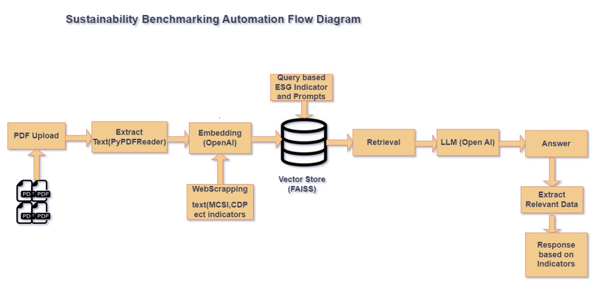

# EcoBenchmark

#Run Commands

Local: uvicorn api:app --reload

Azure: gunicorn -w 2 -k uvicorn.workers.UvicornWorker api:app

## Dependencies and Installation
----------------------------
To install the EcoBenchmark App, please follow these steps:

1. Clone the repository to your local machine.

2. Install the required dependencies by running the following command:
   ```
   pip install -r requirements.txt
   ```

3. Obtain an API key from OpenAI and add it to the `.env` file in the project directory.
```commandline
OPENAI_API_KEY=openai_api_key
AZURE_OPENAI_API_KEY=OPENAI_API_KEY
AZURE_OPENAI_ENDPOINT=endpoint
AZURE_OPENAI_DEPLOYMENT_NAME=deployment_name
```

# App Flow



